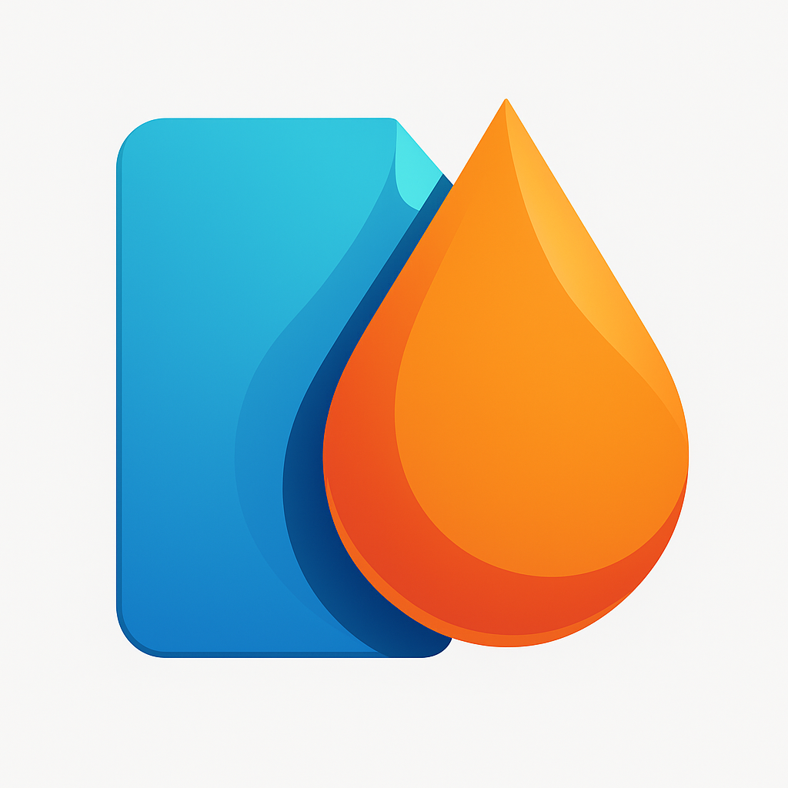
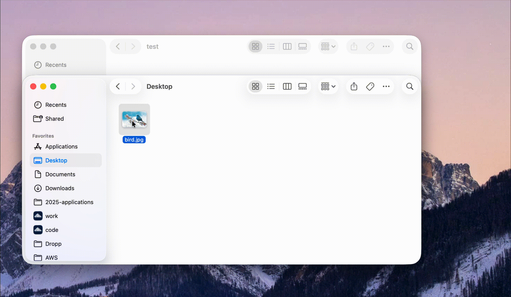

<div align="center">
  
  <h1>Dropp</h1>
  <p><strong>Cross-Platform Dropzone with Cloud Sync</strong></p>
  <p>Drag files to your Dropp shelf on macOS, then sync them to the cloud with a click. Access them on Android and other devices.</p>
</div>

---

## What is Dropp?

Dropp is a modern cross-platform dropzone that keeps your files accessible across all your devices. Drag files to your shelf on macOS, then click to sync them to the cloud—they'll be available on your Android phone and other devices. Unlike traditional file transfer methods, Dropp gives you a persistent shelf with the ability to quickly move files between your devices.

Currently working for macOS and Android, with Windows support coming soon.

## Demo

Here's the macOS app in action:



## Key Features

- **🔓 Completely Open-Source** – Full source code available on GitHub for transparency and community contribution
- **☁️ Cloud Sync** – Upload files to the cloud from macOS and access them on Android and other devices
- **📦 Native macOS Dropzone** – Fast, native dropzone interface with floating panel design
- **📱 Native Android App** – Complete Android app for accessing your synced files on the go
- **🔐 Secure Authentication** – Firebase Authentication with encrypted session management
- **⚡ Zero Configuration** – Sign in once, access everywhere
- **🎯 Persistent Shelf** – Keep files in your shelf and sync them across devices when you need to

## Platform Support

| Platform | Status | Notes |
|----------|--------|-------|
| **macOS** | ✅ Working | Native SwiftUI app with dropzone UI and Cloud Sync |
| **Android** | ✅ Working | Native Android app with Cloud Sync |
| **Windows** | 🚧 In Development | Coming soon |
| **iOS** | 🚧 Planned | Coming soon |

## Architecture

Dropp is built on a modern, cloud-native architecture:

```
┌──────────────────────────────────────┐
│  macOS App  │  Android App           │
│  (SwiftUI)  │  (Native)              │
└────────────┬─────────────────────────┘
             │
      Next.js Backend (Vercel)
             │
    ┌────────┼────────┐
    │        │        │
 MongoDB  Vercel   Firebase
          Blob      Auth
```

**Key Technologies:**
- Backend: Next.js with TypeScript on Vercel
- Database: MongoDB Atlas
- File Storage: Vercel Blob
- Authentication: Firebase

## Getting Started

### Prerequisites

- Node.js 18+ (for backend development)
- Xcode 14+ (for macOS app development)
- Android Studio 2021+ (for Android development)
- A Firebase project with Google authentication configured

### Backend Setup

```bash
cd backend

# Install dependencies
npm install

# Configure environment
# Create a `.env.local` file with your MongoDB URI, Firebase credentials, and other required secrets

# Start development server
npm run dev
```

The backend will be available at `http://localhost:3000`

### macOS App Setup

```bash
cd macos/Dropp

# Open in Xcode
open Dropp.xcodeproj

# Build and run (Cmd+R)
```

### Android App Setup

```bash
cd android

# Open in Android Studio and build/run on emulator or device
```

## Contributing

We welcome contributions! Please follow these guidelines:

1. Fork the repository
2. Create a feature branch (`git checkout -b feature/amazing-feature`)
3. Commit your changes (`git commit -m 'Add amazing feature'`)
4. Push to the branch (`git push origin feature/amazing-feature`)
5. Open a Pull Request

## Project Structure

```
Dropp/
├── backend/           # Next.js REST API backend
├── macos/            # SwiftUI macOS application
├── android/          # Native Android application
└── Dropp.icon/       # Brand assets
```

## Support

For issues, feature requests, or questions:
- Open an issue on GitHub
- Contact support through our website
- Check our documentation wiki

## License

This project is licensed under the MIT License – see the LICENSE file for details.

---

<div align="center">
  <p><strong>Dropp – Make file transfer effortless across all your devices</strong></p>
</div>
